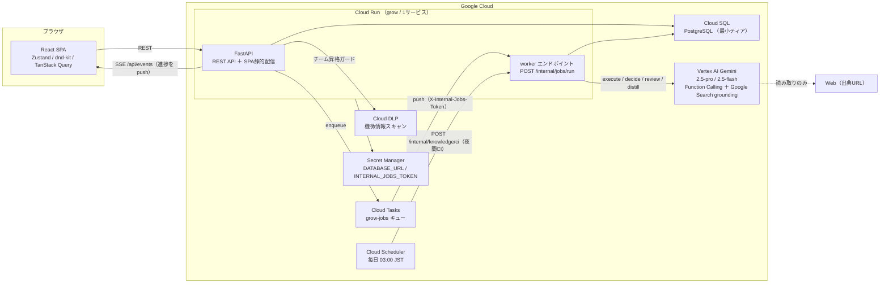
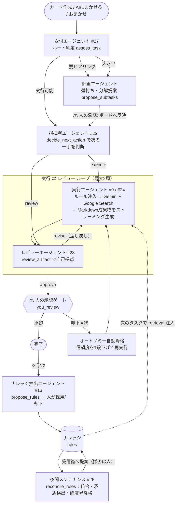

# Grow — 使うほど、人とAIが共に育つタスクボード

> 人とAIが同じカードの上で協働する **場**。人が指示を残し、AIが作業して履歴を残し、その履歴を見た人がまた指示や判断を重ねる——**やり取りの履歴が積み重なるほど、AIは「自分のやるべきこと」を学んで成長し、人もAIへの任せ方・判断を磨いていく**。使うほど双方に馴染んでいく、人とAIの協働の場です。

- 🌐 **本番環境（実 Gemini で稼働中）:** <https://grow-c6m2ic6jcq-an.a.run.app>
- 🎬 **デモ動画:** _（提出時に差し替え — [docs/submission/demo_script.md](docs/submission/demo_script.md) の台本で撮影）_
- 📄 **仕様の単一の真実:** [`docs/design_handoff_baton/00_decisions_and_platform.md`](docs/design_handoff_baton/00_decisions_and_platform.md)

---

## なぜ作ったか — 課題

日々の仕事にAIを取り入れようとすると、次の3つの摩擦にぶつかります。

1. **ツール遷移の手間** — タスクはタスク管理ツール、AIは別のチャットアプリ。行き来しながら文脈をコピペする。
2. **毎回の説明の面倒** — AIに頼むたびに「私はこういう書き方が好みで、出典は必ず付けて…」と前提を説明し直す。履歴は積み上がらない。
3. **AIが勝手に進めすぎる** — 頼んでいない判断までAIが独断で進めてしまい、あとで手戻りになる。役割の線引きが曖昧。

## どう解いたか — 価値

Grow はこの3つを、看板ボードという慣れた道具の上でまとめて解きます。

1. **看板で一元化** — タスク管理とAI実行が同じカードの上に同居する。ツールを行き来しない。
2. **履歴が積み重なり、人もAIも育つ** — カードに溜まった人とAIのやり取りが資産になる。AI側は履歴から「働き方のルール」を学び、**言われなくても前提として読んでから動く**ようになる（使うほど成果物が自分にフィットする）。人side も、AIへの任せ方・指示の出し方・判断の線引きが、やり取りを重ねるほど磨かれていく。**片方が賢くなるのではなく、同じ場で人とAIが互いに育つ**のが Grow の核です。
3. **ルールと権限で適切に協働** — カード単位のオートノミー（L0〜L3）と行動範囲ポリシーでAIの裁量を制御。AIは人にしかできない判断に達したら勝手に決めず、明示して人に引き継ぐ。

**「いま誰が動く番か」が常に一目で分かります。** カード左端の色バー（AI=ティール / 人=アンバー）と上部の「あなたの番 N / AI稼働 N」カウンタが、積み重なる履歴の上で次に手を入れるのが人かAIかを示します。人とAIが交互に履歴を足していくことで、タスクが前に進み、同時に両者の学びが溜まっていきます。

---

## アーキテクチャ

Cloud Run 1サービスで API と SPA 静的配信を兼ね、AIの実作業は Cloud Tasks でジョブ化して同じサービスの worker エンドポイントへ push する構成です（Redis 不要でコスト最小 / scale-to-zero）。



### エージェント編成

Grow は単一のAIではなく、**役割の異なる6種のエージェントが順に処理を引き継ぐチーム**として動きます。指揮者エージェントが「次に何をすべきか」を Gemini 自身に判断させ（`decide_next_action`）、各役割エージェントのジョブを連鎖させます。暴走を防ぐため、**人の承認ゲート**（分解のボード反映・最終承認）を要所に残しています。



**役割の流れ:** 受付（ルート判定）→ 計画（壁打ち・分解）→ 指揮者（次の一手を判断）→ 実行（成果物生成）⇄ レビュー（自己採点・差し戻し）→ 人の承認 → ナレッジ抽出（学ぶ）→ 夜間メンテナンス（腐らせない）。溜まったルールは次のタスクの実行時に自動で前提注入され、**「使うほど賢くなる」ループが閉じます**。

---

## 主要機能

各機能は実装 PR（#番号）に対応します。

| 機能 | 概要 | PR |
| --- | --- | --- |
| 看板ボード | 5レーン（バックログ / ToDo / 進行中 / レビュー / 完了）、DnD、正規化ストア、「あなたの番 / AI稼働」カウンタ | #6 #8 |
| カード詳細ドロワー | コメント/アクティビティ・スレッド、コンポーザ、SSE ライブ更新 | #7 |
| AIにまかせる（実行） | 着手前に該当ルールを retrieval して system 注入、非同期ジョブで Markdown 成果物を生成しハンドオフ | #9 #10 |
| 適用ルールの可視化 | 「AIが着手時に前提にするルール」をドロワーに表示（ブラックボックス化しない） | #10 |
| 壁打ち → 分解 | チャットモードで前提を詰め、`propose_subtasks` で子タスク候補を提示。人が承認して反映 | #11 #12 |
| 手動蒸留（学ぶ） | 完了カードの履歴から `propose_rules` でルール候補を抽出、人が採用/却下 | #13 |
| ナレッジ・オーバーレイ | ルール一覧・確度・適用回数・出典。個人ルールをチームへ昇格 | #14 |
| Vertex Gemini プロバイダ | Function Calling ＋ Google Search grounding の実装（`AI_PROVIDER=gemini`） | #15 |
| GCP デプロイ | Cloud Run へのデプロイ用冪等スクリプト集と本番検証チェックリスト | #16 |
| 汎用ジョブ・ディスパッチ | kind → 実行関数のレジストリ。worker と local ランナーが収束 | #18 |
| エージェント役割バッジ | コメントに役割バッジ、リレー・タイムライン、ライブ稼働フィード | #19 |
| 差分リプレイ | 成果物の版間 diff の再生、ルール適用フラッシュ | #20 |
| オートノミー / ポリシー | カード単位の L0〜L3 ダイヤルと行動範囲（Web検索可否・コスト上限） | #21 |
| 指揮者エージェント（オートパイロット） | `decide_next_action` で次の一手を自己判断し役割エージェントを連鎖 | #22 |
| AIセルフレビュー | `review_artifact` で自己採点し、構造化した指摘で自分に差し戻す（最大2周） | #23 |
| ライブ・ストリーミング生成 | Gemini のストリームで成果物を逐次生成し画面へ流す | #24 |
| 意思決定トレース ＋ コスト実算定 | 成果物の版ごとに「どのジョブが・どのルールを前提に・何トークン/$いくらで生成したか」 | #25 |
| 夜間ナレッジCI | Cloud Scheduler 起動の `reconcile_rules`：重複統合・矛盾検出・確度の昇降格・受信箱通知 | #26 |
| 受付エージェント | カード作成時にルート（実行/ヒアリング/分解）を自己判定し、足りなければ自分から質問 | #27 |
| 信頼度の自動降格 | 人が差し戻すとオートノミーを1段自動降格し遷移ログに記録 | #28 |
| チーム昇格 DLP ガード | 個人→チーム昇格前に Cloud DLP で機微情報を検査し、AIで一般化を提案 | #29 |

---

## 使用技術（ハッカソン要件との対応）

**必須要件1 — GCPアプリケーション実行基盤:**

- **Cloud Run** — 1サービスで FastAPI（API）＋ SPA 静的配信＋ジョブ worker を兼任。scale-to-zero で待機コスト0。

**必須要件2 — Google Cloud の AI サービス（二重に充足）:**

- **Vertex AI Gemini** — 実作業（execute）は `gemini-2.5-pro`、分解・蒸留・判断・レビュー・受付は `gemini-2.5-flash`。**Function Calling**（`propose_subtasks` / `propose_rules` / `decide_next_action` / `review_artifact` / `check_rule_conflicts` / `reconcile_rules`）で構造化出力を受け取り、**Grounding with Google Search** で出典付きの情報収集（読み取りのみ）を行う。
- **Cloud DLP（Sensitive Data Protection）** — 個人ルールをチームへ昇格する前の機微情報ガードレール（#29）。

**任意要件:**

- **Cloud SQL for PostgreSQL** — tasks / comments / rules / artifacts / ai_jobs 等を保持（最小ティア、将来 pgvector）。
- **Cloud Tasks** — AI実作業のジョブキュー。worker（`POST /internal/jobs/run`）へ push、指数バックオフ再試行。
- **Cloud Scheduler** — 夜間ナレッジCI（毎日 03:00 JST → `POST /internal/knowledge/ci`）。
- **SSE** — AIの進捗・成果物ストリーミングをサーバ→クライアントへ単方向 push（`/api/events`）。
- 補助: **Secret Manager**（`DATABASE_URL` / `INTERNAL_JOBS_TOKEN`）、**Artifact Registry**（コンテナ）、**Cloud Build**（CI ビルド）。

**フロントエンド:** React 19 + TypeScript + Vite / Zustand（正規化ストア）/ @dnd-kit / TanStack Query（楽観更新）/ remark-gfm（成果物プレビュー）/ SSE。

**バックエンド:** FastAPI（Python 3.13、uv、パッケージ名 `app`）/ asyncpg / Pydantic v2 / google-genai / google-cloud-tasks / google-cloud-dlp。

> **コスト最小化の設計:** LLM 呼び出しは `AiProvider` インターフェイスで抽象化し、`AI_PROVIDER=mock | gemini` の1変数で切替。ローカル開発・自動テストは決定的な **Mock**（費用ゼロ・ネットワーク不要）、実 Gemini を叩くのは本番と動作検証時のみ。同じく DLP も mock（正規表現スタブ）と本番を切替。

---

## ローカル開発（Mock 前提・費用ゼロ）

ローカルは `AI_PROVIDER=mock`（既定値）で動くため、GCP・LLM の費用は一切かかりません。必要ツール: Node 22+ / npm 10+ / uv / PostgreSQL（`pg_ctl`。Docker があれば自動利用）。

```bash
make setup       # 依存インストール（frontend: npm / backend: uv）
make db-start    # ローカルDB起動（port 54329, db=grow, user=grow）
make be-dev      # FastAPI  → http://localhost:8000（/healthz, /docs）
make fe-dev      # Vite SPA → http://localhost:5173（/api, /healthz は :8000 へプロキシ）
```

`frontend/dist` がある状態で backend を起動すると、FastAPI が SPA を静的配信し、Cloud Run と同じ1サービス構成をローカルで再現できます。環境変数は [`.env.example`](.env.example) を参照。

## テスト・Lint・ビルド

```bash
make test   # backend (pytest) + frontend (vitest)
make lint    # ruff check + tsc --noEmit
make build   # SPA 本番ビルド
```

**テスト状況:** バックエンド 357 tests（pytest）/ フロントエンド 337 tests（vitest）。Mock プロバイダにより DB とスタブAIだけで全フローを決定的に検証できます。

## デプロイ

Cloud Run へのデプロイは [`infra/`](infra/) の冪等スクリプトで行います（実行順: `00_setup` → `10_database` → `20_migrate` → `30_deploy`、夜間CIは `40_scheduler`）。詳細は [`infra/README.md`](infra/README.md)、デプロイ後の本番動作検証は [`infra/VERIFICATION.md`](infra/VERIFICATION.md) を参照。

```bash
export PROJECT_ID=<GCPプロジェクトID>
bash infra/00_setup.sh
bash infra/10_database.sh
bash infra/20_migrate.sh --seed
bash infra/30_deploy.sh
bash infra/40_scheduler.sh   # 夜間ナレッジCI（任意）
```

---

## ドキュメント

- [`docs/design_handoff_baton/`](docs/design_handoff_baton/) — 設計引き継ぎ書（`00` が最初に読む文書。仕様の単一の真実）
- [`docs/submission/`](docs/submission/) — ハッカソン提出資料（ProtoPedia 下書き・デモ台本・スクショ指示）

## ライセンス

[MIT License](LICENSE) © 2026 andoooooo-bb
